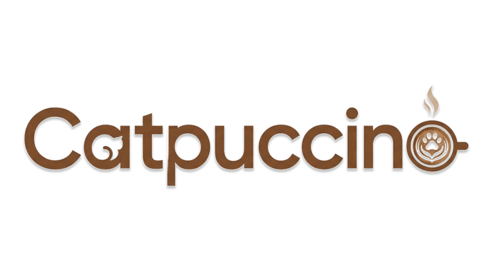
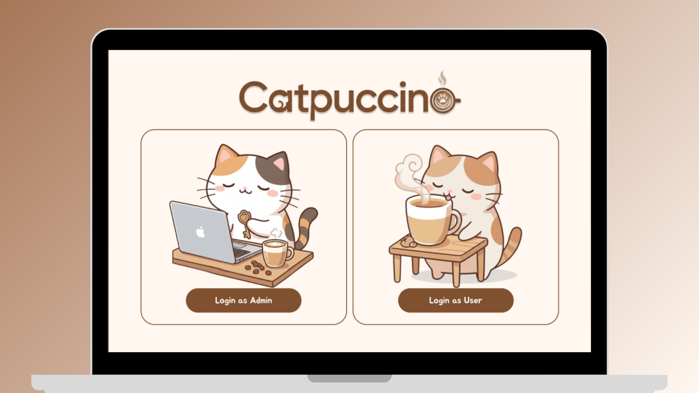
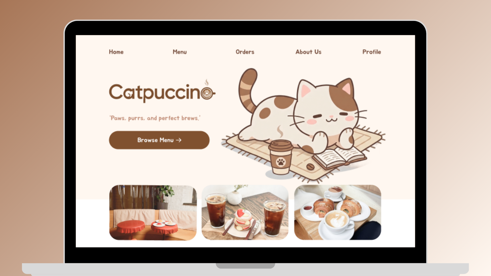
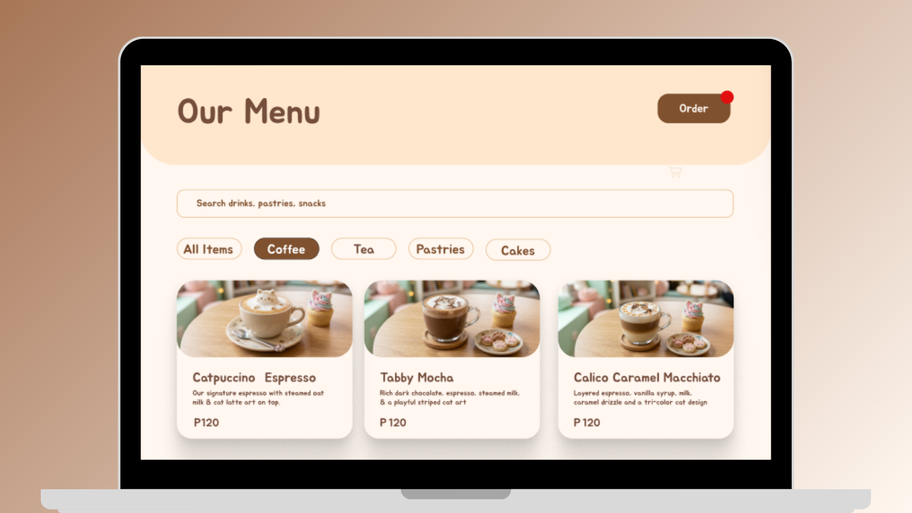
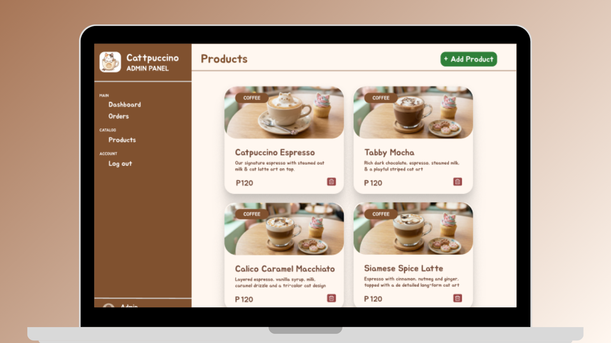

<div align="center">


# Catpuccino


*A specialized Point of Sale and Management System designed for cat cafes. Catpuccino streamlines ordering, and inventory tracking.*
</div>

---

## ☕ Screenshots

<div align="center">
<table border="0" style="border: none; border-collapse: collapse;">
  <tr>
    <td align="center" style="border: none; padding: 8px;">
      
      <br/>
      <sub>🔐 Login & Sign Up</sub>
    </td>
    <td align="center" style="border: none; padding: 8px;">
      
      <br/>
      <sub>🏠 Home Page</sub>
    </td>
    <td align="center" style="border: none; padding: 8px;">
      
      <br/>
      <sub>🍰 Cafe Menu</sub>
    </td>
    <td align="center" style="border: none; padding: 8px;">
      
      <br/>
      <sub>📦 Cafe Inventory</sub>
    </td>
  </tr>
</table>
</div>

---

## 🛠️ Tech Stack

<div align="center">


</div>

---

## ⚙️ Key Features

**🧾 Multi-Handling System**
> Tracks customer orders and payments. Upload different products such as pastry, cake, coffee, tea, and more.

**🔄 Real-Time Data Sync**
> Newly uploaded menus are synced real-time on the customer end.

**🗄️ Tri-Data Sync Engine**
> A unified database that instantly connects point-of-sale transactions with physical inventory updates, customer profiles, and customer orders.

**🐱 Cozy UI Staff Portal**
> A minimalist, cat-themed interface with soft color visual cues for fast and stress-free navigation.

---

## 🚀 How to Run

**1. Open the project in Visual Studio**

**2. Open the Package Manager Console**
> Go to `Tools` → `NuGet Package Manager` → `Package Manager Console`

**3. Run the migration command**
```
Add-Migration InitialCreate
```

**4. Apply the database**
```
Update-Database
```

**5. Launch the application** — you're all set! 🎉

<br/>

**🔐 Admin Login Credentials**

| Field | Value |
|---|---|
| Username | `admin` |
| Password | `admin123` |

---

## 👥 Team

-d4b896?style=for-the-badge)


**Project Manager:**
> Trixette Rain A. Montallana

**Members:**
> Jhon Rovic A. Ramos<br/>
> Bridget Narte<br/>
> Roshele Faye Labiaga<br/>
> John Armand Alvarez

<div align="center">

</div>
